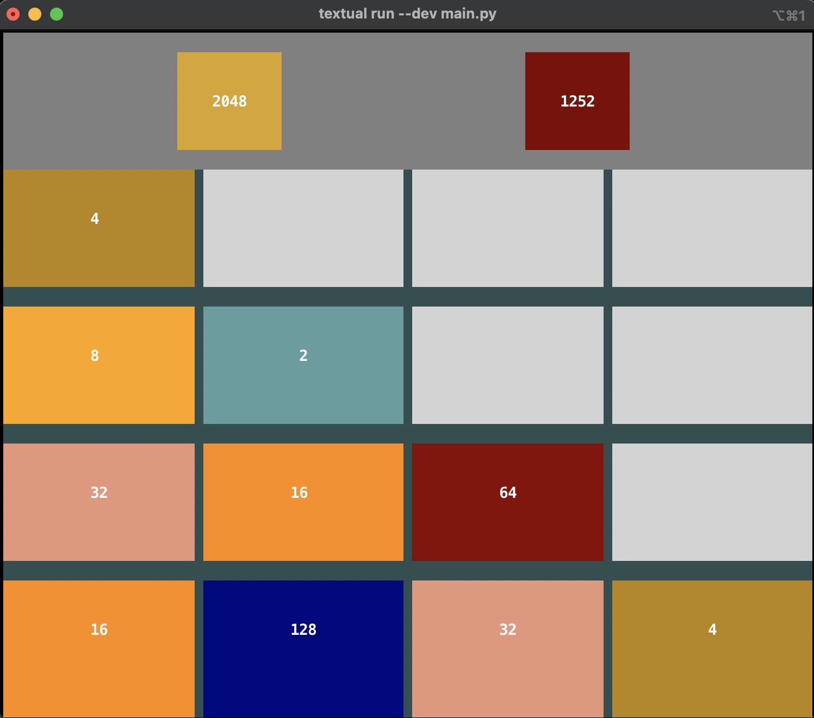

### It's 2048 game but it's inside your terminal & written in Python



### Install & Play
```bash
$ git clone
$ cd 2048game
$ pip3 install -r requirements.txt
```
* Make sure to have virtual environment activated
#### start game
```bash
$ python3 main.py
```
or 
```
$ textual run --dev main.py
```

* Terminal size should be at least 90 x 35

* Use arrow keys (right, left, up, down) to move in game
